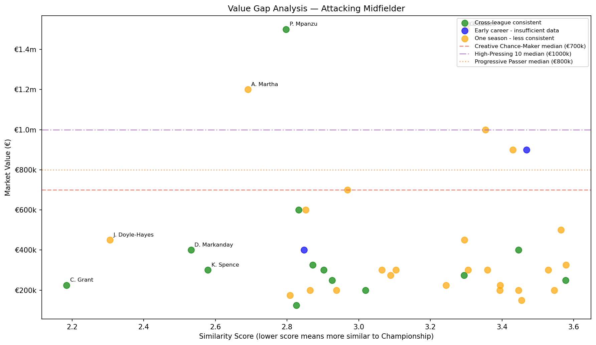

# EFL Hidden Gems — A Data-Driven Player Scouting Model

A machine learning scouting model that identifies Championship-ready talent across EFL League One and League Two, combining statistical profiling with market value analysis to surface undervalued transfer targets.

Built as a portfolio project after my first year studying Data Science at the University of Bristol.

---

## Motivation

Championship clubs operate under significant financial constraints, yet the difference between promotion and relegation can hinge on one or two shrewd signings. Traditional scouting is expensive and subjective - this project explores whether a data-driven approach can systematically identify lower league players whose statistical profiles already match Championship level, before the market recognises their value.

The core question: **which League One and League Two players are performing above their level, and which clubs are best at producing them?**

---

## Data

- **Player statistics:** [Hudl Wyscout](https://www.hudl.com/en_gb/products/wyscout) — per-90 metrics across attacking, defensive, passing, goalkeeping and set-piece categories.
- **Leagues:** EFL Championship (benchmark), EFL League One, EFL League Two
- **Seasons:** 2025/26 (primary) and 2024/25 (consistency check)
- **Market valuations:** Wyscout market value data
- **Minimum threshold:** 900 minutes played per season - in order to ensure per-90 metrics are truly representative

> Note: Wyscout data was accessed via a personal subscription. Raw data files are not included in this repository in accordance with Hudl's terms of service.

---

## Methodology

The pipeline runs across 11 steps:

```
Raw Wyscout exports (10 CSV files)
        ↓
  Ingestion & merging
        ↓
  Cleaning & filtering (900 min threshold)
        ↓
  Position group assignment (7 groups)
        ↓
  Per-90 verification
        ↓
  Championship profiling (k-means clustering)
        ↓
  League One/Two normalisation (Championship scale)
        ↓
  Candidate similarity scoring (Euclidean distance)
        ↓
  Value gap analysis (absolute + percentage)
        ↓
  Age segmentation & consistency flagging
        ↓
  Visualisation & shortlisting
```

### Position groups

Players are grouped into 7 position categories based on Wyscout position codes:

| Group | Positions |
|---|---|
| Goalkeeper | GK |
| Centre Back | CB, RCB, LCB |
| Full Back | RB, LB, RWB, LWB |
| Defensive Midfielder | DMF, RDMF, LDMF |
| Attacking Midfielder | CMF, RCMF, LCMF, AMF, RAMF, LAMF |
| Winger | RWF, LWF, RW, LW |
| Striker | CF |

### Championship profiling

K-means clustering on normalised Championship data identifies distinct playing archetypes per position — e.g. Ball-Playing CB vs Defensive CB vs Rotational CB. The elbow method helps to determine the optimal number of clusters (k=2-3 per position group).

Championship scalers are saved and applied to League One/Two data, ensuring all similarity scores are calculated relative to the Championship baseline rather than within-league norms.

### Candidate scoring

Each League One/Two player's Euclidean distance to their nearest Championship cluster centroid is calculated as their **similarity score** — lower scores indicate closer statistical similarity to a Championship archetype.

Candidates are filtered to the 25th percentile of similarity scores per position group, producing a focused shortlist of the most Championship-similar players.

This shortlist is then separated into players with an established market value from the Wyscout platform and those without - producing two final dataframes of candidates.

### Value gap analysis

Two value gap metrics are calculated per valued candidate:

- **Absolute value gap:** Championship cluster median market value − player market value
- **Percentage value gap:** value gap as a percentage of the cluster median

Percentage value gap is used as the primary ranking metric for the players with an established market value to enable fair cross-position comparisons.

### Consistency flagging

Players are assigned one of four consistency tiers:

| Tier | Meaning |
|---|---|
| Cross-league consistent | Strong performance across both seasons and across league levels |
| Same-league consistent | Strong performance across both seasons in the same league |
| One season | 25/26 data only |
| Early career — insufficient data | U21 players in their first professional season |

> **Note:** No players in the final candidate pool received a "Same-league consistent" 
> label. This is an interesting finding in itself — players performing 
> above their level in League One or Two tend to be identified and signed by higher 
> clubs between seasons, meaning those who remain in the same league across both seasons 
> are less likely to stand out as exceptional candidates. As a result, there was a dominance
> of Cross-league consistent candidates in the valued and watchlist dataframes. 

---

## Key Findings - valued candidates

### Headline players (age ≤ 28, 25/26 season)

| Player | Club | Position | Age | Archetype | Similarity | Market Value | Value Gap % | Consistency |
|---|---|---|---|---|---|---|---|---|
| C. Grant | Notts County | AM | 24 | High-Pressing 10 | 2.18 | €225k | 77.5% | Cross-league consistent |
| N. Guinness-Walker | Northampton Town | FB | 26 | Balanced FB | 2.04 | €250k | 86.1% | Cross-league consistent |
| B. Woods | Peterborough Utd | DM | 23 | Ball-Winner DM | 2.22 | €150k | 87.5% | One season |
| J. Gibson | Doncaster Rovers | Winger | 28 | Inside Forward | 1.89 | €300k | 70.0% | One season |
| B. House | Lincoln City | Striker | 27 | Rotational Striker | 1.71 | €250k | 64.3% | Cross-league consistent |
| L. Macari | Notts County | CB | 24 | Rotational CB | 2.46 | €225k | 83.9% | Cross-league consistent |
| L. Southwood | Bolton Wanderers | GK | 28 | Standard Shot-Stopper | 1.60 | €500k | 58.3% | Cross-league consistent |

### Club analysis

The model identifies clubs whose squads contain the highest concentration of Championship-ready players among cross-league consistent candidates:

**Lincoln City and Notts County lead with 4 candidates each** - both clubs earned promotion at the end of the 25/26 season (Lincoln City to the Championship, Notts County to League One), providing encouraging real-world validation that the model's profiling captures genuine quality.

### Spotlight: C. Grant (Notts County)

The model's standout individual finding. Cross-league consistent across two seasons, C. Grant's radar chart shows he not only matches but **exceeds** the Championship High-Pressing 10 archetype average in defensive duels won and progressive runs — all while valued at €225k against a €1m Championship cluster median.

---

## Visualisations

### Value gap scatter plots

One per position group — similarity score (x-axis) vs market value (y-axis), with Championship cluster median reference lines. Players in the bottom-left quadrant are the primary targets: statistically Championship-ready and undervalued.

*Example — Attacking Midfielder:*

  

### Radar charts

One per position group, comparing the lead valued candidate's metric profile against their Championship archetype centroid.

*Example — C. Grant vs High-Pressing 10 archetype:*

   

### Club analysis

    
 
---

## Watchlist

Players with no recorded market value are separated into a watchlist rather 
than excluded — 23.8% of candidates fell into this category, with a mean age 
of 23.9, suggesting many are young players whose value hasn't yet been 
established rather than fringe squad members.

Strongest watchlist findings:

- **W. Davies (Fleetwood Town, ST, age 27)** — similarity score of 1.76, 
  the lowest of any striker in the dataset. No market value recorded, 
  representing potentially exceptional value for a data-driven club willing 
  to look beyond established valuations.

- **J. McGregor (Swindon Town, FB, age 20)** — cross-league consistent at 
  just 20 years old with no market value recorded. The strongest long-term 
  prospect in the watchlist and the youngest cross-league consistent player 
  in the entire dataset.

- **J. Bland (Barnsley, DM, age 21)** — early career flag, Ball-Winner DM 
  profile already matching Championship benchmarks at 21. Contract until 2029 
  suggests Barnsley are aware of his potential.

- **L. Woodhouse (Exeter City, CB, age 21)** — Ball-Playing CB profile, 
  early career flag, strong similarity score of 2.74. A young defender 
  already showing the progressive passing metrics that define Championship 
  centre backs.

---

## Limitations

- **Market valuations** are sourced from Wyscout and may lag behind actual transfer market conditions, particularly for lower league players
- **Physical data** (sprint distances, high-intensity runs) was not available — the model relies largely on technical and tactical metrics
- **Winger sample size** — only 14 Championship wingers met the minutes threshold, limiting the reliability of cluster archetypes for that position
- **Context not captured** — team playing style, injury history, and character are not reflected in per-90 statistics
- **Single platform** — all data sourced from Wyscout; cross-platform validation was not performed

---

## Tech Stack

- Python 3.12
- pandas, numpy — data manipulation
- scikit-learn — StandardScaler, KMeans
- scipy — Euclidean distance calculation
- matplotlib — scatter plots, bar charts
- mplsoccer — radar charts

---

## Project Structure


The full pipeline is implemented in a single Jupyter notebook — 
`EFL_Player_Analysis.ipynb` — structured sequentially across 11 annotated steps.

---

## Future Work

- Incorporate more physical tracking data if access becomes available (e.g. via StatsBomb 360 or club GPS feeds)
- Extend to National League or lower-tier foreign leagues - like Scottish Championship or Ligue 2 (France's 2nd tier) with appropriate data quality caveats
- Build an interactive dashboard (Streamlit or Dash) for position-by-position exploration
- Apply the same methodology to identify overvalued Championship players ahead of potential relegation
- Add transfer history analysis to quantify which clubs have the best track record of selling on players identified by the model

---

*Built by Ben Kearsey, Data Science student at the University of Bristol — July 2026*
